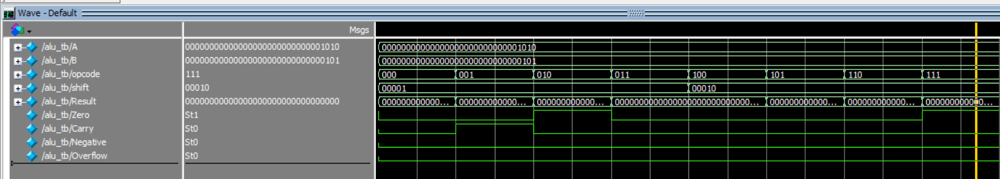

## Block Diagram

The ALU contains multiple functional units working together.

A,B Inputs
↓
ALU Control Unit
↓
Arithmetic Unit (CLA Adder)
↓
Logic Unit (AND, OR, XOR)
↓
Barrel Shifter
↓
Result Output

Flags Generated:

* Zero
* Carry
* Negative
* Overflow

## Supported Operations

| Opcode | Operation     | Description                 |
| ------ | ------------- | --------------------------- |
| 000    | AND           | Bitwise AND between A and B |
| 001    | OR            | Bitwise OR between A and B  |
| 010    | ADD           | Addition using CLA Adder    |
| 011    | SUB           | Subtraction using CLA Adder |
| 100    | XOR           | Bitwise XOR                 |
| 101    | SHIFT LEFT    | Logical left shift          |
| 110    | SHIFT RIGHT   | Logical right shift         |
| 111    | SET LESS THAN | Comparison operation        |

## Simulation Waveform

The ALU was simulated using ModelSim.

Example waveform:

The waveform verifies arithmetic, logical and shift operations.

## Tool Flow (ModelSim)

Compilation Order:

vlog cla_adder.v
vlog barrel_shifter.v
vlog alu_control.v
vlog parameterized_alu.v
vlog alu_tb.v

Simulation Commands:

vsim alu_tb
add wave *
run -all

The waveform confirms correct functionality of the ALU design.
