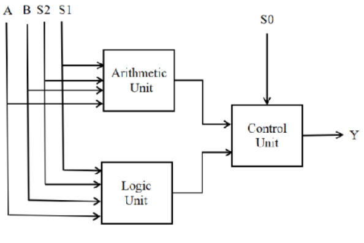
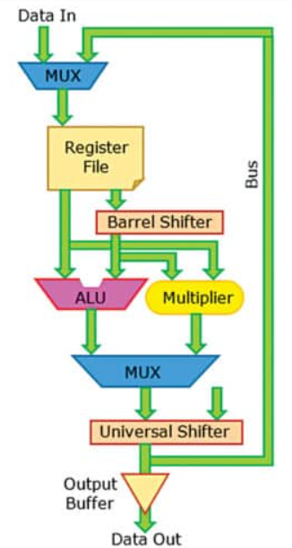

# 32-bit Parameterized ALU (Verilog)

## Overview
This project implements a **32-bit parameterized Arithmetic Logic Unit (ALU)** in Verilog.  
The design supports arithmetic, logical, and shift operations selected through a **3-bit opcode**.  
A **Carry Lookahead Adder (CLA)** is used for fast arithmetic computation and a **Barrel Shifter** enables efficient shift operations.  
The design is verified using **ModelSim simulation** with a dedicated testbench.

---

## Architecture

<p align="center">
  
</p>

**Data Path**

```
Inputs (A, B)
      │
      ▼
ALU Control Unit
      │
 ┌───────────────┬───────────────┬
 │               │               │
 ▼               ▼               ▼
CLA Adder     Logic Unit     Barrel Shifter
(ADD/SUB)   (AND/OR/XOR)     (SHIFT)

                 │
                 ▼
              Result


```
##Datapath architecture
<p align="center">
  
</p>


**Status Flags**

- **Zero (Z)** – Result equals zero  
- **Carry (C)** – Carry generated during arithmetic operation  
- **Negative (N)** – Result sign bit is high  
- **Overflow (V)** – Arithmetic overflow detected

---

## Supported Operations

| Opcode | Operation | Description |
|------|------|------|
| 000 | AND | Bitwise AND |
| 001 | OR | Bitwise OR |
| 010 | ADD | Addition using CLA |
| 011 | SUB | Subtraction using CLA |
| 100 | XOR | Bitwise XOR |
| 101 | SHIFT LEFT | Logical left shift |
| 110 | SHIFT RIGHT | Logical right shift |
| 111 | SET LESS THAN | Comparison operation |


## Project Structure

```
32-bit-Parameterized-ALU
│
├── parameterized_alu.v   # Top ALU module
├── alu_control.v         # Opcode decoding logic
├── cla_adder.v           # Carry Lookahead Adder
├── barrel_shifter.v      # Shift operation unit
├── alu_tb.v              # Testbench
├── waveform.png          # Simulation result
└── README.md
```

---

## ModelSim Simulation Flow

**1. Compile Design Files**

```
vlog cla_adder.v
vlog barrel_shifter.v
vlog alu_control.v
vlog parameterized_alu.v
vlog alu_tb.v
```

**2. Run Simulation**

```
vsim alu_tb
add wave *
run -all
```

**Explanation**

- `vlog` – Compiles Verilog modules into the simulation library  
- `vsim alu_tb` – Launches simulation using the testbench  
- `add wave *` – Displays all signals in the waveform window  
- `run -all` – Executes the simulation until completion

---


## Simulation

<p align="center">
  
</p>

The waveform confirms correct ALU behavior for arithmetic, logical, and shift operations.

---

## Author

**Divya Sree**  
M.Tech – VLSI Design
